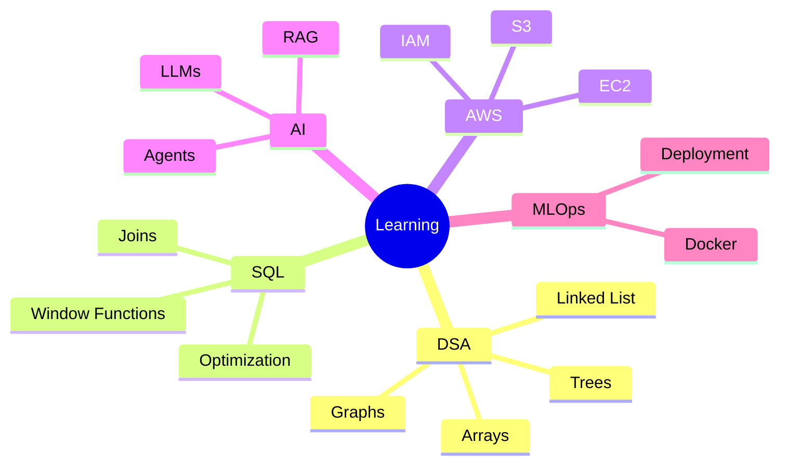

<div align="center">


<br>


</div>

---

# 💫 About Me

```yaml
Name: Omkar Udawant
Degree: B.E. Artificial Intelligence & Data Science
CGPA: 9.93/10
Location: Pune, India

Current Role:
  - AI Intern @ FlyRank
  - Former Data Science & Analytics Intern @ Future Interns

Interests:
  - Artificial Intelligence
  - Machine Learning
  - Data Science
  - Cloud Computing
  - Backend Development
  - Generative AI

Currently Learning:
  - Data Structures & Algorithms
  - Advanced SQL
  - AWS Cloud
  - MLOps
  - LLM Applications
```

---

## 🌐 Connect With Me

<div align="center">

<a href="https://linkedin.com/in/omkar-udawant">

</a>

<a href="https://github.com/Omkar-Udawant">

</a>

<a href="mailto:udawantomkar10@gmail.com">

</a>

<a href="https://leetcode.com/u/Omiii333/">

</a>

<a href="https://instagram.com/omkar_udawant_333">

</a>

</div>

---

# 🏆 Achievement Showcase

<div align="center">

| Achievement | Status |
|------------|--------|
| 🥈 National Level Techathon 3.0 | Runner-Up |
| 🏆 Smart India Hackathon (College Level) | Winner |
| 🚀 FlyRank AI Internship | Completed |
| 📊 Future Interns Data Science Internship | Completed |
| 🏅 Smart India Hackathon Internal Round | Selected |
| 🎓 Current CGPA | 9.93 |

</div>

---

# 🚀 Experience

### 🤖 AI Intern | FlyRank

- Worked on AI-powered applications and intelligent automation systems.
- Explored AI Search, LLM workflows, and Generative AI technologies.
- Built practical AI solutions and enhanced AI fluency.

### 📊 Data Science & Analytics Intern | Future Interns

- Business Sales Performance Analytics using Power BI.
- Customer Retention & Churn Analysis.
- Marketing Funnel Analysis.
- KPI Dashboard Development and Reporting.

---

# 🛠 Tech Arsenal

<div align="center">


</div>

---

# 🚀 Featured Projects

### 🎓 College Legacy Alumni Platform

```text
Full Stack Alumni Networking Platform
├── Authentication
├── Messaging System
├── Alumni Directory
├── Recommendations
└── Analytics Dashboard
```

**Tech:** React • Node.js • Express • MySQL

---

### 🚦 Intelligent Traffic Management System

```text
AI Traffic Monitoring
├── YOLOv8
├── FastAPI
├── OpenStreetMap
├── SUMO
└── Traffic Prediction
```

**Tech:** Python • YOLOv8 • FastAPI

---

### 🏥 Clinical Trials Data Analytics

```text
Healthcare Analytics
├── ETL Pipeline
├── PostgreSQL
├── Power BI Dashboard
└── Data Reporting
```

**Tech:** PostgreSQL • Power BI

---

### 🎙️ Regional Language Voice Assistant

```text
Speech + NLP System
├── Speech Recognition
├── Natural Language Processing
├── Text To Speech
└── Regional Dialects
```

**Tech:** Python • NLP • ML

---

# 📜 Certifications

<div align="center">

| Certification |
|--------------|
| AWS Cloud Practitioner Training |
| IBM Getting Started with AI |
| Agile Scrum in Practice |
| Introduction to Machine Learning |
| Python Programming & Data Analytics |

</div>

---

# 🌱 Current Learning Path



---

# 📊 GitHub Analytics

<div align="center">


</div>

---

# 🔥 GitHub Streak

<div align="center">


</div>

---

# 🏅 LeetCode Profile

<div align="center">

<a href="https://leetcode.com/u/Omiii333/">


</a>

</div>

### Current Progress

```yaml
Username: Omiii333
Focus: DSA + Placements
Solved: 20+
Easy: 16
Medium: 4
Hard: 0
```

---

# 🏆 GitHub Trophies

<div align="center">


</div>

---

# 🐍 Contribution Snake

<div align="center">


</div>

---

# 📈 Contribution Graph

<div align="center">


</div>

---

# 💭 Philosophy

<div align="center">

### "Turning Data Into Intelligence, Intelligence Into Impact."

</div>

---

<div align="center">

### ⭐ Thanks for visiting my profile!

🚀 AI • ML • Data Science • Cloud • Innovation

</div>


